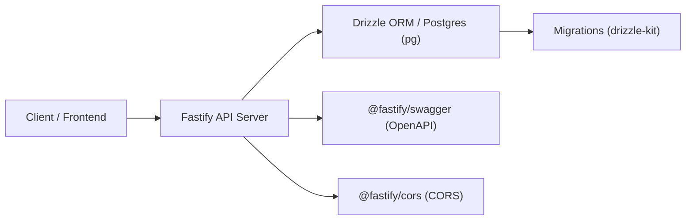

# Auth API (API do Desafio Fullstack)

## Visão Geral

Esta pasta contém a API do projeto "desafio-fullstack" — um serviço leve em Node.js que serve endpoints REST/HTTP, gerencia migrações e persiste dados usando Postgres (via Drizzle ORM). A API expõe rotas relacionadas ao domínio do desafio (ex.: listagem de webhooks, esquema de webhooks, migrações) e é pensada para ser usada em conjunto com a aplicação web no repositório principal.

Repositório principal do projeto: https://github.com/izaiasmorais/desafio-fullstack

## Arquitetura

Diagrama simplificado da API e dependências:



Também existem integrações de utilitários para documentação (Swagger) e políticas de CORS.

Principais responsabilidades da API:

- Expor endpoints HTTP com Fastify
- Validar tipos e contratos com Zod (via fastify-type-provider-zod / drizzle-zod)
- Gerenciar migrações e gerar modelos com Drizzle (drizzle-kit)
- Servir como backend para operações persistentes (Postgres)

## Estrutura do Projeto

Resumo dos arquivos e pastas presentes em `api/`:

- `package.json` - Dependências e scripts (dev/start/migrate/seed/etc.)
- `tsconfig.json` - Configuração TypeScript
- `biome.json` - Configuração do biome (formatter / linter)
- `drizzle.config.ts` - Configuração do Drizzle ORM
- `docker-compose.yml` - (quando presente) configuração de containers úteis para desenvolvimento
- `src/` - Código-fonte do servidor
  - `src/server.ts` - Ponto de entrada do servidor Fastify
  - `src/env.ts` - Variáveis de ambiente/ configurações carregadas pela API
  - `src/db/` - Configuração do DB, migrations e esquemas (drizzle)
    - `migrations/` - SQL de migrações e histórico
    - `schema/` - Definições de tabelas/colunas (ex.: `webhooks.ts`)
  - `src/routes/` - Rotas expostas pela API (ex.: `list-webhooks.ts`)

Essa estrutura torna a API simples de entender: configuração do ORM e migrações em `src/db`, rotas em `src/routes`, inicialização em `src/server.ts`.

## Tecnologias

Esta API utiliza as seguintes tecnologias (extraídas de `api/package.json`):

- Runtime & Web framework
  - Node + Fastify (`fastify`) — servidor HTTP rápido e plugin-friendly
- ORM / Migrations
  - Drizzle ORM (`drizzle-orm`) e `drizzle-kit` — mapeamento e gerenciamento de migrations
  - `pg` — driver Postgres
- Validação / Tipagem
  - Zod (`zod`) — validação de schemas
  - `fastify-type-provider-zod` e `drizzle-zod` — integração Zod com Fastify e Drizzle
- Utilitários e Documentação
  - `@fastify/swagger` — geração de documentação OpenAPI/Swagger
  - `@scalar/fastify-api-reference` — helpers para referências de API
  - `@fastify/cors` — política CORS
- Outros
  - `uuidv7` — geração de UUIDs

Dependências de desenvolvimento:

- TypeScript (`typescript`, `@types/node`, `@types/pg`)
- `tsx` — executa/observa arquivos TypeScript em desenvolvimento
- Biome (`@biomejs/biome`) — formatação/lint

Scripts úteis (definidos em `package.json`):

- `pnpm dev` — inicia o servidor em modo desenvolvimento (`tsx watch src/server.ts`)
- `pnpm start` — inicia a build/servidor compilado (quando aplicável)
- `pnpm lint` — formata o código com Biome
- `pnpm generate` / `pnpm migrate` / `pnpm studio` — comandos do `drizzle-kit` para gerar modelos, aplicar migrações e abrir studio

## Setup

Passos rápidos para rodar a API localmente (assumindo que o Postgres esteja disponível):

1. Instale dependências

```bash
pnpm install
```

2. Configure variáveis de ambiente

Crie um arquivo `.env` (ou use o método preferido da sua infra) contendo as configurações do banco e outros segredos necessários (ex.: `DATABASE_URL`, `PORT`, etc.). A configuração exata de variáveis depende de `src/env.ts`.

3. Executar migrações (Drizzle)

```bash
pnpm migrate
```

4. Rodar em modo desenvolvimento

```bash
pnpm dev
```

5. Endpoints

Após rodar, verifique os endpoints definidos em `src/routes/` (ex.: `/list-webhooks`) e, se configurado, a documentação Swagger disponível via plugin (`@fastify/swagger`).

---

Observação: este README foca apenas na pasta `api/`. Para informações sobre o frontend e integração completa, consulte o repositório principal: https://github.com/izaiasmorais/desafio-fullstack
